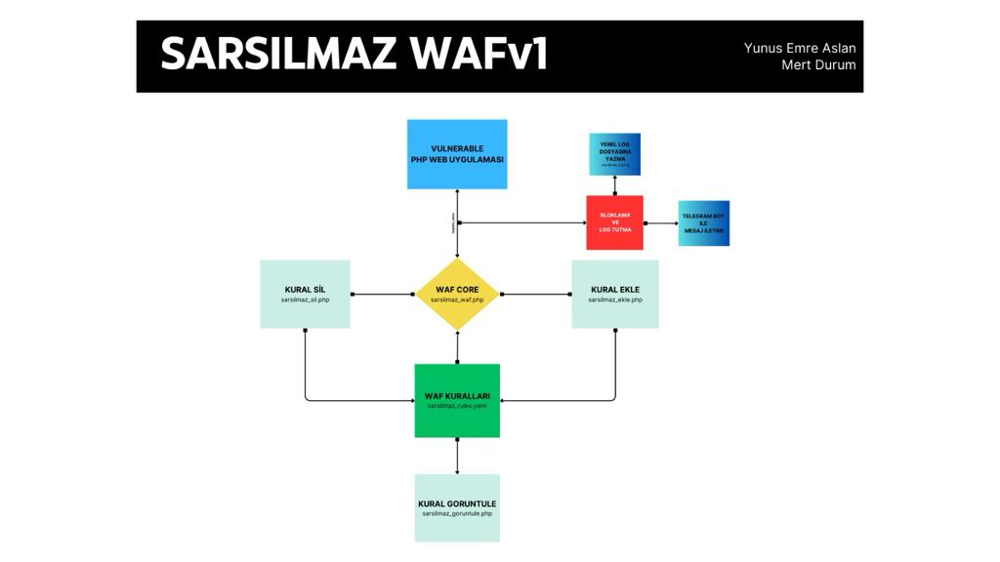

# SARSILMAZ Modüler WAF + Zafiyetli Web Uygulama



Sarsılmaz, PHP ile geliştirilmiş bir modüler Web Uygulama Güvenlik Duvarı (WAF) sistemidir. Bu WAF, PHP web uygulamalarınızı güvenlik açıklarına karşı korumak için tasarlanmıştır.

## Özellikler

- **Modüler Tasarım:** Sarsılmaz, kolayca özelleştirilebilen ve genişletilebilen bir modüler yapıya sahiptir.
- **Keyword Tabanlı Filtreleme:** Belirlenen anahtar kelimeleri izleyerek potansiyel saldırıları tespit eder ve engeller.
- **Günlükleme:** Sarsılmaz, tespit edilen saldırıları günlüğe kaydederek ve telegram api ile ileterek inceleme ve analiz imkanı sunar.

## Kurulum

Sarsılmaz'ı kullanmak için aşağıdaki adımları takip edebilirsiniz:

1. Projeyi kendi bilgisayarınıza klonlayın: `git clone https://github.com/kullaniciadi/sarsilmaz.git`
2. Gerekli bağımlılıkları yükleyin: `composer require symfony/yaml`

## Kullanım

Sarsılmaz'ı kullanmak oldukça basittir. Aşağıda temel bir örnek bulunmaktadır:

```php
<?php
require_once 'sarsilmaz_waf.php';
?>
